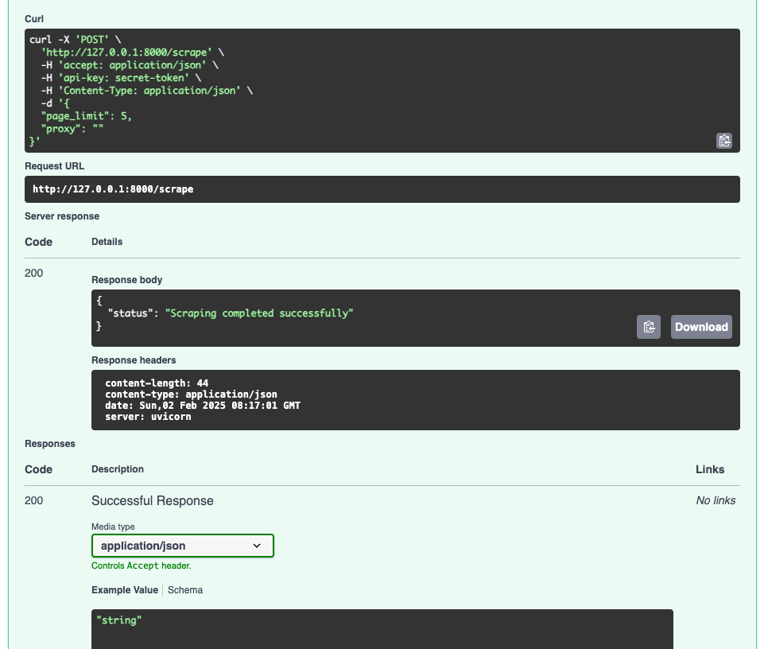

# Atlys Web Scraper

### Scraping
1. **Product Information Extraction**  
   - Scrapes product names, prices, and images directly from the catalogue pages.  
   - Avoids opening individual product cards

2. **Configurable Settings**  
   - **Page Limit**: Limits the number of catalogue pages to scrape.  
   - **Proxy Support**: Accepts a proxy string to route scraping requests.  

3. **Retry Mechanism**  
   - Retries failed page requests after a configurable delay

### Data Integrity and Validation
- Implements type validation
- Caching via Redis


## Installation

1. Clone the repository:
   ```bash
   git clone https://github.com/srikary12/scraping-assignment.git
   cd scraping-assignment
   ```

2. Create and activate a virtual environment:
   ```bash
   python3 -m venv venv
   source venv/bin/activate 
   ```

3. Install dependencies:
   ```bash
   pip install -r requirements.txt
   ```

---

## Usage

1. **Run the FastAPI Server**  
   Start the FastAPI server locally:
   ```bash
   fastapi dev main.py
   ```

2. **API Endpoints**
   - **`/scrape`** (POST): Start a new scraping session. Accepts optional parameters:
     - `num_pages`: Number of pages to scrape.
     - `proxy`: Proxy string for request routing.
   - **Authentication**: Add a static token in the request header:
     ```text
     api-key: secret-token
     ```

---

## Example Configuration

```
api-key: secret-token
```
```json
{
  "pages": 5,
  "proxy": "http://my-proxy-server:8080"
}
```

---

## Output

### JSON Format
Data is saved locally in a db.json file in the following structure:
```json
[
  {
    "product_title": "Example Product",
    "product_price": 2450.00,
    "path_to_image": "/path/to/image.jpg"
  }
]
```

### Notifications
Sample console output after scraping:
```
INFO:scraping-assignment.external_services.notification:Successfully updated 5 products..
```

---

## Design Overview

### Folder Structure
  - `Schemas`: Pydantic models.
  - `external_services`: Notification services.
  - `utils`: Cache, auth, storage services with abstract classes.


## Demo





